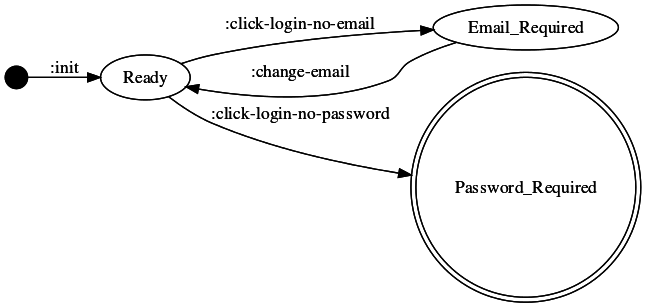
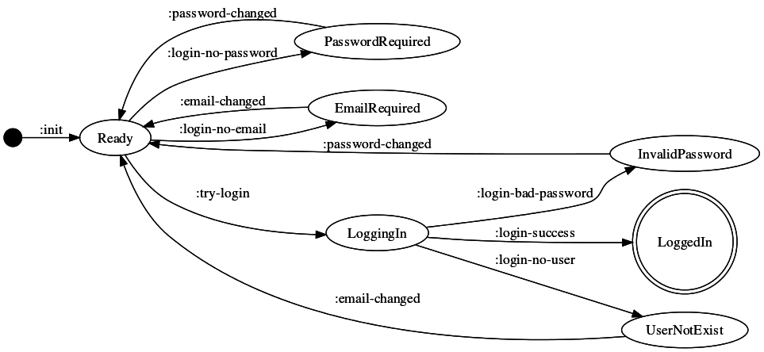

# Restate Your UI: Creating a User Interface with Re-frame and State Machines

I said it [before]() and I'll say it again: I hate working on user interfaces.
It's not the interfaces themselves, it's the code behind them that drives me a
little crazy.  Behind most user interfaces is an ad hoc tangle of features
layered on top of other features that I would call byzantine except that would
be an insult to the hardworking builders of the Byzantine empire.

In that last article I talked about the ideas behind a state machine based
approach to UI programming, one avoids much of the pain of the more traditional
approach.  In this article I'm going to take you through an example of how to
apply this technique using a simple login UI.  We're going to use Clojurescript
and, since this will be a React app, we'll use [Re-frame]().  If you haven't
used Re-frame, don't worry, there's not that much to it and we'll be sticking
to the Clojure idioms you are already using.

## Modeling Your UI

The example we'll be working with is a simple login UI. Let's assume the [usual
rules]() apply.  Email and password can't be blank.  Show one error at a time.
Disable the login button when an error is visible.

<p align="center">

</p>

The traditional sequence for building a UI is to start by writing code to
render things on the screen.  We throw up some buttons, drop-downs, lists and
then compose them into views.  Once we have enough of this rendering code in
place, we wire things together with events.  And then, when we can't go any
further, we add state.  In other words, we build it from the bottom-up.

;; TODO maybe would be better to say "We'll take a different approach here,
;; starting from the top, by thinking about ...
;; rather than specifically saying "top-down" anywhere.

We'll take a different approach here. We'll do some top-down design _before_ we
write a line of code.  We're going to start by thinking about events and
application states in order to rough out a high-level model using [State
Transition Diagrams]().

<p align="center">

</p>

It's tempting to try to list out all of the UI's states then connect them.
We're not going to do that.  We're building UI.  UI is event-driven.  We know
from the [previous article]() that user actions (and system events) become the
transitions of the State Transition Diagram.  So we'll start there.  We'll walk
through the things a user can do, discovering all of our UI's states as we go.
As each new state is discovered, we'll add it to a table which describes it.
The UI starts out with all of its text fields and buttons enabled.  We'll name
that state `Ready`, and make it our starting state.

```
State | Error Message | Login Button
------+---------------+-------------
Ready   ""              Enabled
```


There's really only two things a user can do from the `Ready` state: type some
text into a field, or click the Login button.  Let's start with the button
click.  We'll call this action `click_login_button`.  The result is to display
the error "email required" and to disable the Login button.  Since our UI's
appearance has changed, that means we've moved to a new state state, which
we'll call `Email_Required`.

;; TODO Notice how time has passed.

So we add the details about `Email_Required` to our table, and to our State
Transition Diagram.

```
State          | Error Message   | Login Button
---------------+-----------------+-------------
Ready            ""                Enabled
Email_Required   "email required"  Disabled
```


From our `Email_Required` state, we again try to imagine all the actions a user
can take.  Since the Login button is disabled, their only options are to enter
an email or password.  At this point, nothing interesting happens if they
change the password, so we'll ignore it.  However, if they enter their email,
we need to remove the "email required" error message.  We'll call that action
`change_email`.  Since there's no longer an error present, we can re-enable the
Login button.  So our UI's appearance changes again, back to what it looked
like in the `Ready` state.

;; TODO More time has passed...

Once again, let's update our State Transition Diagram.  Since we've returned to
the `Ready` state, we don't add anything to the state table.

```
State          | Error Message   | Login Button
---------------+-----------------+-------------
Ready            ""                Enabled
Email_Required   "email required"  Disabled
```


I'm not going to drag you through the entire exercise, but let's do one more
transition.

Back in the `Ready` state, our email field now contains some text.  If we click
that irresistable Login button again, the rules say that since the password is
blank we need to display a "password required" error message, then disable the
Login button.  We'll call our new state, `Password_Required`, and we'll call
this action `click_login_no_password`.  This also seems like a good time to
rename our other actions to make them more specific:

```
State            | Error Message      | Login Button
-----------------+--------------------+-------------
Ready              ""                   Enabled
Email_Required     "email required"     Disabled
Password_Required  "password required"  Disabled
```



Building up a State Transition Diagram incrementally helps you vet requirements
up front (you can probably spot some ambiguities in them), as well as raise UX
desgin questions early.  More importantly, you're able to construct a fairly
complete model of our UI before getting bogged down in code.

As promised, here are the complete state table and State Transition Diagram
we'll refer to during our implementation below.

```
State            | Error Message        | Login Button
-----------------+----------------------+-------------
Ready              ""                     Enabled
Email_Required     "email required"       Disabled
Password_Required  "password required"    Disabled
User_Not_Exist     "user does not exist"  Disabled
Invalid_Password   "invalid password"     Disabled
Loggin_In          ""                     Disabled
```



The State Transition Diagram can be represented using simple Clojure data
literals.

```clojure
{nil                {:init               :ready}
 :ready             {:login-no-password  :password-required
                     :login-no-email     :email-required
                     :try-login          :logging-in}
 :logging-in        {:login-bad-password :invalid-password
                     :login-no-user      :user-not-exist
                     :login-success      :logged-in}
 :email-required    {:email-changed      :ready}
 :password-required {:password-changed   :ready}
 :user-not-exist    {:email-changed      :ready}
 :invalid-password  {:password-changed   :ready}}
```

Before we dive into the code, here are a few things to keep in mind as you dive
into your state machines:

_TIP #1 Your state machine shouldn't require more than a page of Clojure
code._

Your first goal with this approach is building a useful model -- something that
describes your UI at a glance.  Beyond this size, you should consider splitting
it up into multiple state machines.  Generating a diagram from your state
machine's data can help with this, but usually right around the time the code
becomes hard to read, so does the diagram.

_TIP #2 Keep similar things together._

You don't need to create one state machine for your entire UI, or even a single
view.  For example, if your UI has a user profile page which lets the user
update their mailing addres in one pane, and notifications settings in another,
you'll probably want to separate your state machines similarly.  We'll go into
more depth on this in a future post.

_TIP #3 _

;; TODO


## Re-frame

[Re-frame](https://github.com/Day8/re-frame) is a Clojurescript library for
building React applications.  While the FSM approach will work with any library
or framework it fits Re-frame's data oriented design well.  For a proper
introduction to Re-frame, check out [Eric Normand's guide]().  We'll quickly
cover the very basics here.

* Application state
* Rendering
* Subscriptions
* Events

All of Re-frame's application state is stored in one place using a single
[Reagent]() `atom`. Any changes to that atom will trigger a render.  Rendering
in Re-frame is done just as you'd expect: you use pure functions to produce a
representation of the DOM using [Hiccup]() data.

```clojure
(defn comment
 [comment]
 [:div
   [:span (:text comment)]
   [:span (:author comment)]])
```

Re-frame's subscriptions API lets you expose a particular slice of app state to
a component. The `comments` component below will render whenever the data
returned by the `:comments` subscription changes.

```clojure
(defn comments
  []
  (let [comments (subscribe [:comments])]
    [:div (map comment @comments)])) ;; <- note you have to deref

(reg-sub
  :comments
  (fn [db _] (sort-by :date (get db :comments))))
```

Now for the fun part.  True to its functional nature, Re-frame's _essence_
is nothing more than a reduction.  To compute the current app state, simply
reduce over any queued events by using their registered handler functions.

```clojure
(reduce handle-event app-state event-queue)
```

Where `handle-event` can be as simple as a pure function of app state and an
event, returning a new app state.

```clojure
(defn handle-login
  [current-app-state event]
  ...
  new-app-state)

;; Register event handler to a keyword
(re-frame.core/reg-event-db :login handle-login)
```

This looks eerily similar to a state machine's state transition function, which
is a function of the current state and a transition (and the state machine
itself), returning the next state.

```clojure
(defn next-state
  [state-machine current-state transition]
  ...
  next-state)
```

To recap, our state machine is a map.

```clojure
(def state-machine {nil                {:init               :ready}
                    :ready             {:login-no-password  :password-required
                                        :login-no-email     :email-required
                                        :try-login          :logging-in}
                    :logging-in        {:login-bad-password :invalid-password
                                        ...}
                    ...}
 ```

With this in mind, a basic implementation of `next-state` is pretty simple.

```clojure
(defn next-state
  [state-machine current-state transition]
  (get-in state-machine [current-state transition]))
```

`update-next-state` uses Re-frame's app state to keep track of the current
state of our login state machine. `handle-next-state` is the last link in the
chain, allowing us to do what we've been describing: treat Re-frame events as
the transitions of our state machine.

```clojure
(def login-state-machine { ... })

(defn update-next-state
  [db event]
  (update db :state (partial next-state login-state-machine) event))

(defn handle-next-state
  [db [event _]]
  (update-next-state db event))
```

The tiny amount of code it takes to adapt our state machine data to Re-frame's
event handlers is an indicator of how naturally they fit together.  As usual,
Clojure's powerful data literals deserve a lot of the credit.


## Ready --> Design --> Code

Now that we have our model in hand, we can switch back to some bottom-up
coding.  We'll start with a simple rendering function that knows nothing about
events or app state.

```clojure
(defn ui
  []
  [:div
   [:form
    "Email" [:br]
    [:input] [:br]
    "Password" [:br]
    [:input] [:br]
    "Password" [:br]
    [:input {:type "button"
             :value "Login"}]]])
```

First, let's take care of some basic plumbing and wire our inputs up to app
state.  This new rendering code for the email input refers to two new things:
an `[:email]` subscription, and an `[:change-email`] event. The event should
look familiar.

```clojure
[:input
  {:value @(rf/subscribe [:email])
   :on-change #(rf/dispatch [:change-email (-> % .-target .-value)])}]
```

We'll register the subscription, to get email from app state.

```clojure
(rf/reg-sub
  :email
  (fn [db _] (get db :email)))
```

And an event handler, to store email in app state.

```clojure
(defn handle-change-email
  [db [_ email]
  (assoc db :email email))

(rf/reg-event-db :change-email handle-change-email)
```

;; TODO do we need to stop, show the UI, say we can type into the fields?

After doing the same for our password input, let's wire up the button's
`click` event.

```clojure
[:input {:type "button"
             :value "Login"
             :on-click (fn [e] (rf/dispatch [:login-click]))}]

(defn handle-login-click
  [db _]
  ;; Noop, no chnage to app state.
  db)

(rf/reg-event-db :login-click handle-login-click)
```

With the plumbing out of the way, things can finally get interesting. We're
going to start integrating our login state machine which we defined during the
above design.  We'll start by adding logic to handle a blank email.  So, we're
interested in the transition from `Ready` to `Email_Required`, via
`login_no_email`.

```clojure
(defn handle-click-login
  [{:keys [email] :as db} _]
  (if (string/blank? email)
    (update-next-state db :login-no-email)
    db))
```

In other words, when the email is blank, all we have to do is advance our state
machine using the appropriate transition.  That's it!  Actually, we can do a
bit better.  As with [Redux]() actions, Re-frame's postition is that
semantically useful, named events are a good thing.  Some people feel this gets
a little ping-pongy, but fine-grained events are great for traceability.  They
play well with debugging tools like [Re-frisk](), and facilitate time travel.

```clojure
(defn handle-click-login
  [{:keys [email] :as db} _]
  (if (string/blank? email)
    {:db db
     :dispatch [:login-no-email]}
    {:db db}))

;; Register as a effects generating event handler
(rf/reg-event-fx :login-click handle-login-click)
(rf/reg-event-db :login-no-email handle-next-state)
```

To finish implementing the blank email validation, we've got to update our
rendering code with logic to display the error, and disable the submit button
when necessary.

```clojure
(defn ui
  []
  [:div
   (when-let [failure @(rf/subscribe [:failure])]
     [:div {:style {:color "red"}} failure])
   [:form
    ...
    [:input {:type "button"
             :value "Login"
             :disabled @(rf/subscribe [:login-disabled?])
             :on-click (fn [e] (rf/dispatch [:login-clicked]))}]]])
```

We've added two new subscriptions: `[:failure]` and `[:login-disabled]`. This
is another spot we feel like this approach really shines.  We'll implement
these subscriptions solely based on our state machine's current state.

```clojure
;; Top-level subscription
(rf/reg-sub
  :state
  (fn [db _] (get db :state)))

;; Depends on [:state] subscription
(rf/reg-sub
  :failure
  (fn [db _] (rf/subscribe [:state]))
  (fn [state _] (case state
                  :email-required "email required"
                  :password-required "password required"
                  :user-not-exist "user not found"
                  :invalid-password "invalid password"
                  nil)))

;; Depends on [:state] subscription
(rf/reg-sub
  :login-disabled?
  (fn [db _] (rf/subscribe [:state]))
  (fn [state _] (not= state :ready)))

```

Not only does this keep app state simple,  but it lets us take advantage of
Re-frame's subscription [signal
graph](https://github.com/Day8/re-frame/blob/master/docs/SubscriptionInfographic.md).
Long story short, if `:state` doesn't change, neither of the two new
subscriptions which depend on it will fire.

Moving along in our state machine integration, let's add the logic which
removes the "email required" error message.  Here, we're interested in the
transition from `Email_Required` back to `Ready`, via `change_email`.  We've
already got a handler for this event, so all we need to do is update it.

```clojure
(defn handle-change-email
  [db [event email]]
  (-> db
      (assoc :email email)
      (update-next-state event)))
```

Again, we make use of our existing utilty function to advance the state
machine.  Why didn't we dispatch an additional event in this case?  The
`[:change-email]` event is already represented in our state machine, and there
isn't any conditional logic in the handler -- there's no decision to trace. 

We'll stop there, but this sample's [code]() contains the rest of the
implementation, including how the AJAX call & related events are structured,
and code to generate the state transition diagram image.

## Thanks for Logging In!

So that's how I approach building UIs with state machines: Start with some
upfront design and then start coding.  It works for me and it might just work
for you.  But the real power of state machine based UIs is not really the
process but the output.  You end up with a model -- the state machine itself --
that opens up all sorts of opportunities to test, to visualize, prototype,
maintain and extend you application.

In future posts, I'll tackle DRYing up the code using [interceptors]() and also
show you how to build a more complex UI by composing state machines.
