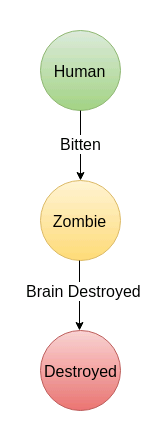
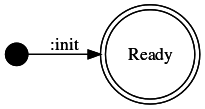
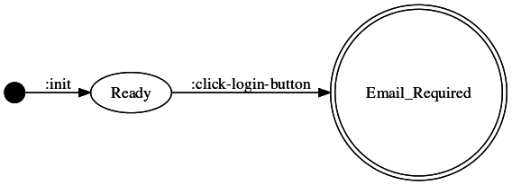
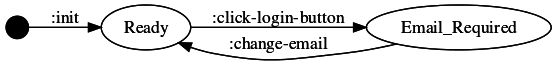

# Restate Your UI: Creating a User Interface with Re-frame and State Machines

Earlier this year our team started experimenting with state machines in our
user interface programming.  After a few months of unusually tolerable UI work,
dozens of "Aha!" moments, and some (lots of) back patting, we looked back and
realized this pattern had transformed our codebase.  A consistent approach to
design and a simple high-level abstraction had made extending each other's code
a piece of cake.

[Last time](), we presented this state machine based approach to UI
programming.  We discussed some of the problems it solves by contrasting it
with a more traditional bottom-up, ad hoc approach.  In this article, we take
you through an example of how to apply this technique using a simple login UI.


<p align="center">

</p>

We're going to use Clojurescript and, since this will be a React app, we'll use
[Re-frame]().  If you haven't used Re-frame, that's ok.  Re-frame does a great
job of sticking to Clojure idioms you're probably already familiar with.  We'll
also give you a quick overview of the basics.


## Modeling Your UI

Prior to our enlightenment, when building a new React UI, we usually began by
writing code to render the things on the screen -- buttons, drop-downs, lists
-- then composed them into views.  Once we had enough of this rendering code in
place, we wired things together with events.  At some point, we were forced to
add state to our UI. In other words, we did bottom-up design.

The design approach presented here is different.  We're going to do some
top-down design before writing a line of code.  We'll examine the UI's events
and its states in order to build a high-level model using a [State Transition
Diagram]().

<p align="center">

</p>

It's tempting to try to list out all of the UI's states then connect them.
We're not going to do that. We're building UI. UI is event-driven.  We know
from the previous article that user actions (and system events) become the
transitions of the State Transition Diagram.  So we'll start there.  We'll walk
through all of the things a user can do, discovering all of our UI's states as
we go.  As each new state is discovered, we'll add it to a table which
describes it.  The UI starts out with all of its text fields and buttons
enabled.  We'll name that state "Ready", and make it our State Transition
Diagram's starting state.

```
State | Error Message | Login Button
------+---------------+-------------
Ready   ""              Enabled
```



There are really only two things a user can do from our `Ready` state: type
some text into a field, or click the Login button.  Buttons are meant to be
clicked, so let's go with that.  Let's call that action `click_login_button`.
The result, per our [requirements](README.md#requirements), is to display the
error "email required" and to disable the Login button.  Since our UI's
appearance has changed, that means we've moved to a new state state, which
we'll call `Email_Required`. Let's add the details about `Email_Required` to
our table, as well as our State Transition Diagram.

```
State          | Error Message   | Login Button
---------------+-----------------+-------------
Ready            ""                Enabled
Email_Required   "email required"  Disabled
```



From our `Email_Required` state, we again try to image all the actions a user
can take. Since the Login button is disabled, their only options are to enter
an email or password.  Consulting our [requirements]() tells us that, at this
point, nothing interesting happens if they change the password.  However, there
is a requirement to _Remove "email required" error when email is changed_.
We'll call that action `change_email`.  There's also a general requirement that
the _Login button is enabled when no error present_.  Our UI's appearance has
changed again, back to what it looked like in the `Ready` state. Once again,
let's update our table and State Transition Diagram.

```
State          | Error Message   | Login Button
---------------+-----------------+-------------
Ready            ""                Enabled
Email_Required   "email required"  Disabled
```



Alright, we're not going to drag you through the entire exercise, but let's
do one more transition, and we'll move on.

Back in the `Ready` state, our email field now contains some text.  If we click
that irresistable Login button again, the rules say that, since the password is
blank, to display a "password required" error message, and to disable the
Login button.  We'll call our new state, `Password_Required`, and we'll call
this action `click_login_no_password` (we'll also update our other action names
to make them more specific).  One last time, we'll update our table and State
Transition Diagram.

```
State            | Error Message      | Login Button
-----------------+--------------------+-------------
Ready              ""                   Enabled
Email_Required     "email required"     Disabled
Password_Required  "password required"  Disabled
```

[start] --> Ready <-change_email- -click_login_no_email-> Email_Required
                  -click_login_no_password-> Password_Required

Building up our State Transition Diagram incrementally helps us to vet
requirements up front (you can probably spot some ambiguities in them), as well
as raise UX questions early. More importantly, we're able to construct a fairly
complete model of our UI before any real coding happens.

```
State            | Error Message        | Login Button
-----------------+----------------------+-------------
Ready              ""                     Enabled
Email_Required     "email required"       Disabled
Password_Required  "password required"    Disabled
User_Not_Exist     "user does not exist"  Disabled
Invalid_Password   "invalid password"     Disabled
Loggin_In          ""                     Disabled
```

[start] --> Ready <-change_email- -click_login_no_email-> Email_Required
                  -click_login_no_password-> Password_Required

;; TODO Add transitions to and from the new states, making sure to add the
;; `Logging_In` state.

The resulting State Transition Diagram can be represented using simple Clojure
data literals.

```clojure
{nil                {:init               :ready}
 :ready             {:login-no-password  :password-required
                     :login-no-email     :email-required
                     :try-login          :logging-in}
 :logging-in        {:login-bad-password :invalid-password
                     :login-no-user      :user-not-exist
                     :login-success      :logged-in}
 :email-required    {:email-changed      :ready}
 :password-required {:password-changed   :ready}
 :user-not-exist    {:email-changed      :ready}
 :invalid-password  {:password-changed   :ready}
```

Before we dive into the code, let's go over a few things we've learned which
might help you when using this design approach.

_TIP #1 Your state machine shouldn't require more than a page of Clojure
code._

Your first goal with this approach is building a useful model -- something that
describes your UI at a glance.  Beyond this size, you should consider splitting
them up.  Generating a diagram from your state machine's data can help with
this, but we've found that right around the time the code becomes hard to read,
so does the diagram.

_TIP #2 Keep similar things together._

You don't need to create one state machine for your entire UI, or even a single
view.  For example, if your UI has a user profile page which lets the user
update their mailing addres in one pane, and notifications settings in another,
you'll probably want to separate your state machines similarly. We'll go into
more depth on this in a future post.

_TIP #3_

;; TODO


## Re-frame

[Re-frame](https://github.com/Day8/re-frame) is a Clojurescript library for
building React applications. While the approach presented here will work
regardless of the library or framework you're using, it fits Re-frame's data
oriented design particularly nicely.  For a proper introduction to Re-frame,
check out [Eric Normand's guide]().  We'll quickly cover the basic pieces here.

* Application state
* Rendering
* Subscriptions
* Events

All of Re-frame's application state is stored in one place -- using a single
[Reagent]() `atom`. Any changes to it trigger rendering.  Rendering in Re-frame
is done exactly how you'd expect: you use pure functions to produce a
representation of the DOM using [Hiccup]() data.

```clojure
(defn comment
 [comment]
 [:div
   [:span (:text comment)]
   [:span (:author comment)]])
```

Re-frame's subscriptions API lets you expose a particular slice of app state to
a component. The `comments` component below will render whenever the data
returned by the `:comments` subscription changes.

```clojure
(defn comments
  []
  (let [comments (subscribe [:comments])]
    [:div (map comment @comments)]))

(reg-sub
  :comments
  (fn [db _] (sort-by :date (get db :comments))))
```

Now, on to the fun part.  True to its functional nature, Re-frame's _essence_
is nothing more than a reduction.  To compute the current app state, simply
reduce over any queued events by using their registered handler functions.

```clojure
(reduce handle-event app-state event-queue)
```

Where `handle-event` can be as simple as a pure function of app state and an
event, returning a new app state.

```clojure
(defn handle-login
  [current-app-state event]
  ...
  new-app-state)

;; Register event handler to a keyword
(re-frame.core/reg-event-db :login handle-login)
```

This looks eerily similar to a state machine's state transition function, which
is a function of the current state and a transition (and the state machine
itself), returning the next state.

```clojure
(defn next-state
  [state-machine current-state transition]
  ...
  next-state)
```

To recap, our state machine is a map.

```clojure
(def state-machine {nil                {:init               :ready}
                    :ready             {:login-no-password  :password-required
                                        :login-no-email     :email-required
                                        :try-login          :logging-in}
                    :logging-in        {:login-bad-password :invalid-password
                                        ...}
                    ...}
 ```

With this in mind, a basic implementation of `next-state` is pretty simple.

```clojure
(defn next-state
  [state-machine current-state transition]
  (get-in state-machine [current-state transition]))
```

`update-next-state` uses Re-frame's app state to keep track of the current
state of our login state machine. `handle-next-state` is the last link in the
chain, allowing us to do what we've been describing: treat Re-frame events as
the transitions of our state machine.

```clojure
(def login-state-machine { ... })

(defn update-next-state
  [db event]
  (update db :state (partial next-state login-state-machine) event))

(defn handle-next-state
  [db [event _]]
  (update-next-state db event))
```

The tiny amount of code it takes to adapt our state machine data to Re-frame's
event handlers is an indicator of how naturally they fit together.  As usual,
Clojure's powerful data literals deserve a lot of the credit.


## More Code

;; TODO punch this transition up

;; START DRAFT 0

After designing our model up front, we usually switch back to a traditional,
bottom-up approach to the rest of the design.  We'll start with a simple
rendering function that knows nothing about events or app state.

```clojure
(defn ui
  []
  [:div
   [:form
    "Email" [:br]
    [:input] [:br]
    "Password" [:br]
    [:input] [:br]
    "Password" [:br]
    [:input {:type "button"
             :value "Login"}]]])
```

First, let's take care of some basic plumbing and wire our inputs up to app
state.  This new rendering code for the email input refers to two new things:
an `[:email]` subscription, and an `[:change-email`] event. The event should
look familiar.

```clojure
[:input
  {:value @(rf/subscribe [:email])
   :on-change #(rf/dispatch [:change-email (-> % .-target .-value)])}]
```

We'll register the subscription.

```clojure
(rf/reg-sub
  :email
  (fn [db _] (get db :email)))
```

And an event handler.

```clojure
(defn handle-change-email
  [db [_ email]
  (assoc db :email email))

(rf/reg-event-db :change-email handle-change-email)
```

;; TODO do we need to stop, show the UI, say we can type into the fields?

After doing the same for our password input, let's wire up the button's
`click` event.

```clojure
[:input {:type "button"
             :value "Login"
             :on-click (fn [e] (rf/dispatch [:login-click]))}]

(defn handle-login-click
  [db _]
  ;; Noop, no chnage to app state.
  db)

(rf/reg-event-db :login-click handle-login-click)
```

With the plumbing out of the way, things can get interesting. We're going to
start integrating our login state machine.  We'll start by adding logic to
handle a blank email.  So, we're interested in the transition from `Ready` to
`Email_Required`, via `login_no_email`.

```clojure
(defn handle-click-login
  [{:keys [email] :as db} _]
  (if (string/blank? email)
    (update-next-state db :login-no-email)
    db))
```

In other words, when email is blank, all we have to do is advance our state
machine using the appropriate transition.  That's it!  Actually, we can do a
bit better.  As with [Redux]() actions, Re-frame's postition is that
semantically useful, named events are a good thing.  Some people feel this gets
a little ping-pongy, but we like fine-grained events for traceability. They
play well with debugging tools like [Re-frisk](), and facilitate time travel.

```clojure
(defn handle-click-login
  [{:keys [email] :as db} _]
  (if (string/blank? email)
    {:db db
     :dispatch [:login-no-email]}
    {:db db}))

;; Register as a effects generating event handler
(rf/reg-event-fx :login-click handle-login-click)
(rf/reg-event-db :login-no-email handle-next-state)
```

To finish implementing the blank email validation, we've got to update our
rendering code with logic to display the error, and disable the submit button
when necessary.

```clojure
(defn ui
  []
  [:div
   (when-let [failure @(rf/subscribe [:failure])]
     [:div {:style {:color "red"}} failure])
   [:form
    ...
    [:input {:type "button"
             :value "Login"
             :disabled @(rf/subscribe [:login-disabled?])
             :on-click (fn [e] (rf/dispatch [:login-clicked]))}]]])
```

We've added two new subscriptions: `[:failure]` and `[:login-disabled]`. This
is another spot we feel like this approach really shines.  We'll implement
these subscriptions solely based on our state machine's current state.

```clojure
;; Top-level subscription
(rf/reg-sub
  :state
  (fn [db _] (get db :state)))

;; Depends on [:state] subscription
(rf/reg-sub
  :failure
  (fn [db _] (rf/subscribe [:state]))
  (fn [state _] (case state
                  :email-required "email required"
                  :password-required "password required"
                  :user-not-exist "user not found"
                  :invalid-password "invalid password"
                  nil)))

;; Depends on [:state] subscription
(rf/reg-sub
  :login-disabled?
  (fn [db _] (rf/subscribe [:state]))
  (fn [state _] (not= state :ready)))

```

Not only does this keep app state simple,  but it lets us take advantage of
Re-frame's subscription [signal
graph](https://github.com/Day8/re-frame/blob/master/docs/SubscriptionInfographic.md).
Long story short, if `:state` doesn't change, neither of the two new
subscriptions which depend on it will fire.

Moving along in our state machine integration, let's add the logic which
removes the "email required" error message.  Here, we're interested in the
transition from `Email_Required` back to `Ready`, via `change_email`.  We've
already got a handler for this event, so all we need to do is update it.

```clojure
(defn handle-change-email
  [db [event email]]
  (-> db
      (assoc :email email)
      (update-next-state event)))
```

Again, we make use of our existing utilty function to advance the state
machine.  Why didn't we dispatch an additional event in this case?  The
`[:change-email]` event is already represented in our state machine, and there
isn't any conditional logic in the handler -- there's no decision to trace. 

We'll stop there, but this sample's [code]() contains the rest of the
implementation, including how the AJAX call & related events are structured,
and code to generate the state transition diagram image.

## Thanks for Logging In!

We've walked you through our thought process during both design &
implementation of a UI using a state machine based approach.  As you've
probably noticed, there's a fair amount of subjectivity involved with each.
That's ok.  The real power here isn't how you arrive at it, but that you're
producing a model -- the state machine itself -- at all.  It opens up all sorts
of opportunities to test, to visualize, prototype, and just makes it easier to
maintain and extend your UI.  Our experience, after using this approach for
several months, was that it dramatically slowed the rate at which UI code
degrades into a pile of spaghetti.  It also made onboarding new members of our
team, who weren't familiar with our tech choices, much easier.

In future posts, we'll tackle DRYing up this code using [interceptors]().
We'll also show you how to build a more complex UI by composing state machines.

;; TODO punch it up, need a concluding sentence
